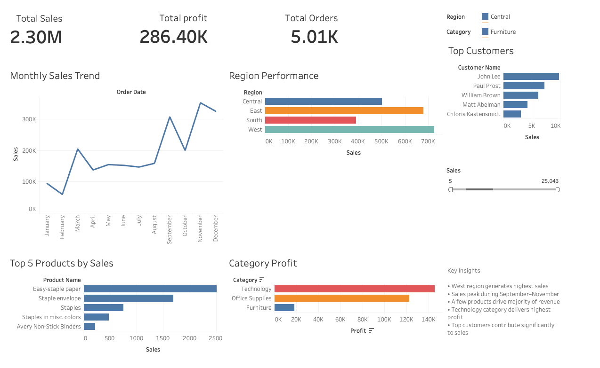

# 📊 Sales Performance Dashboard (Tableau)

## 🔍 Overview

This project presents an interactive **Sales Performance Dashboard** built using Tableau to analyze business data and extract actionable insights. The dashboard provides a comprehensive view of revenue, profitability, customer behavior, and regional performance.

The goal of this project is to demonstrate **data analysis, visualization, and business insight generation skills** using real-world sales data.

---

## 📁 Dataset

* **Source:** Sample Superstore Dataset
* **Records:** ~9,000+
* **Features include:**

  * Order ID, Order Date, Ship Date
  * Customer Name, Region, Category
  * Product Name, Sales, Profit, Quantity

---

## 🎯 Objectives

* Analyze sales and profit trends over time
* Identify top-performing regions, products, and customers
* Evaluate category-level profitability
* Extract meaningful business insights for decision-making

---

## 📈 Dashboard Features

### 🔹 KPI Metrics

* **Total Sales:** 2.3M
* **Total Profit:** 286K
* **Total Orders:** 5K

---

### 🔹 Sales Trend Analysis

* Monthly sales visualization to identify seasonal patterns
* Highlights fluctuations and peak demand periods

---

### 🔹 Regional Performance

* Comparison of sales across regions
* Identifies top-performing geographical areas

---

### 🔹 Top Products Analysis

* Displays top 5 products by sales
* Helps identify high-demand products

---

### 🔹 Category Profit Analysis

* Profit comparison across categories
* Helps identify high-margin business segments

---

### 🔹 Customer Analysis

* Top 5 customers contributing highest revenue
* Highlights key revenue-driving customers

---

### 🔹 Interactive Filters

* Region
* Category
* Date

---

## 💡 Key Insights

* West region generates the highest sales revenue
* Sales peak during **September–November**, indicating seasonal demand
* A small number of products contribute a significant portion of total revenue
* Technology category yields the highest profit margins
* A few high-value customers drive a major share of sales

---

## 🛠 Tools & Technologies

* **Tableau** – Data visualization & dashboard creation
* **SQL** – Data exploration and query-based analysis
* **GitHub** – Project hosting and version control

---

## 📸 Dashboard Preview



---

## 📂 Project Structure

```
sales-dashboard-tableau/
│
├── data/
│   └── superstore.csv
│
├── dashboard/
│   └── sales_dashboard.twbx
│
├── images/
│   └── dashboard.png
│
└── README.md
```

---

## 📥 How to Use

1. Download the `.twbx` file from this repository
2. Open it using Tableau Desktop / Tableau Public
3. Interact with filters to explore insights

---

## 🚀 Project Highlights

* Built an end-to-end BI dashboard from raw dataset
* Applied aggregation and filtering techniques for analysis
* Translated data into actionable business insights
* Designed clean and intuitive visual layout

---

## 💼 Use Case

This dashboard can be used by:

* Business analysts for decision-making
* Sales teams to track performance
* Management to identify growth opportunities

---

## 📌 Future Improvements

* Add profit margin analysis
* Incorporate forecasting models
* Enhance interactivity with advanced filters

---

## 🔗 Author

**Kamaal Ahmad**
Aspiring Data Analyst

---

## ⭐ If you found this useful

Give this repo a ⭐ and connect with me!
